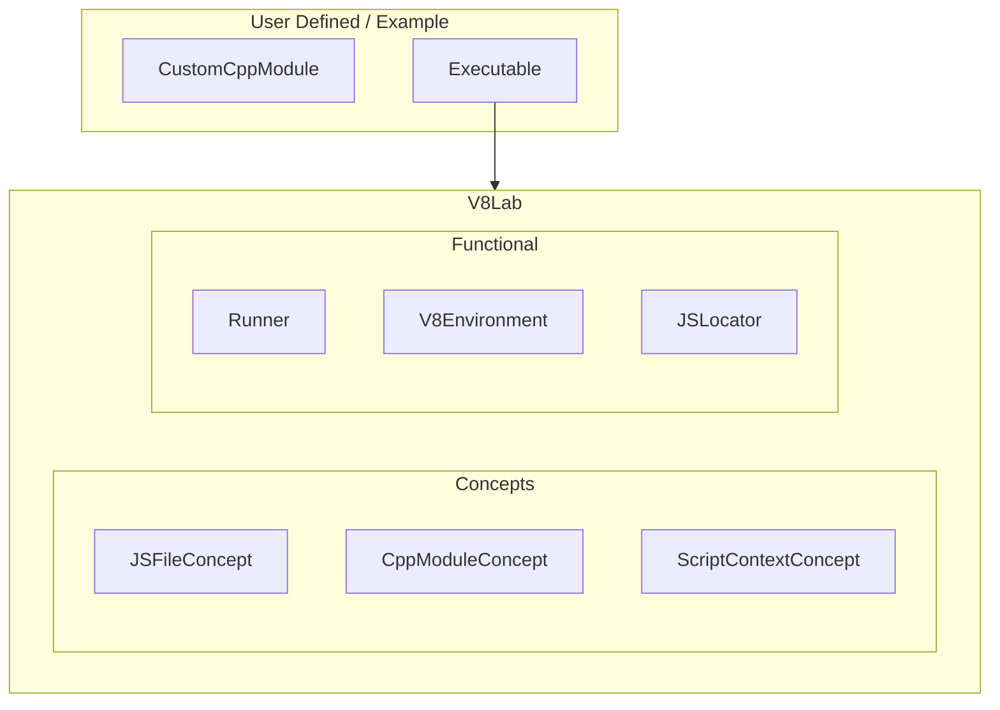

# V8pp-Lab
A modern C++20 environment for experimenting with V8pp: load custom C++ modules, run JS scripts, and prototype V8 integrations quickly.

# Getting started
Note that the library assumes that V8 and [v8pp](https://github.com/pmed/v8pp) have been installed prior.<br>
Since the library is header only it can be included by simply copying the header files in a desire directory. However, it is recommended to use cmake's *fetch_content* or *add_subdirectory*.<br>
From here, create a class / struct that adheres to the **CppModuleConcept**

```cpp
struct CoffeeModule
{
    v8pp::module generateModule(v8::Isolate* isolate) const {
        v8pp::module m(isolate);
        m.const_("MagicTemperature", 42);
        return m;
    }
    std::string_view name() const { return "Coffee";}
};
// Validate if CoffeeModule adheres to the CppModule concept.
static_assert(V8ppLab::CppModule<CoffeeModule>, "Must adhere to CppModule concept!");

```

 and create instance of classes adhering to the **JSFileConcept**. Note that it is recommended to use the **JSLocator** class for file based js content.


```cpp
    V8ppLab::InMemoryScript memoryScript (R"a("Hello JS " + Coffee.MagicTemperature;)a");
    V8ppLab::FileLocator locator ("path/to/my/js/files);
    std::vector<V8ppLab::FileScript> fileBasedScripts = locator.getScripts();
    std::vector<V8ppLab::InMemoryScript> memoryScripts {memoryScript};
```

With this, instantiate the Runner. This will then run your js scripts with your cpp module exposed as a *v8pp::module*.

```cpp
    std::tuple<std::vector<InMemoryScript>, std::vector<FileScript>> scripts{
        memoryScripts,
        fileBasedScripts
    };

    std::tuple<std::vector<CppModule::CoffeeModule>> modules{
        std::vector {CppModule::CoffeeModule()}
    };

    Runner<V8Context> runner {};
    runner.loadModules(std::move(modules));
    runner.run(std::move(scripts));
```

## Customize Script Processing
The classes *InMemoryScript* and *FileScript* have a default processing handling in place. However, it is possible to override this by setting the process *std::function*
```cpp
    InMemoryScript memoryScript (R"a("Hello JS " + Coffee.MagicTemperature;)a");
    memoryScript.process = [](v8::Local<v8::Value> result, v8::Isolate* isolate)
    {
        v8::String::Utf8Value utf8(isolate, result);
        std::cout << "Hi Im customized!" << std::endl << *utf8 << std::endl;
    };
```

Please view the *example* directory for more details.

# About
This project was created for educational purposed and allows to experiment with the v8pp library.

# Library Design
The library relies on C++ 20's concept rather then conventional interfaces. As a result, it highly leverages templates to achieve the same level of abstraction.
The following block diagram describes the component that are involved.


| Bock  | Description  |
|---|---|
| V8Lab | Block that contains all components provided by the library. |
| Concepts | Interfaces used by the library. |
| User Defined / Executable  | Note this is not part of the library. Its a guideline on how the library is intended to be used. The user defined code shall define its own cpp modules adhering to the CppModuleConcept and an executable (main function) to instantiated the Runner. |
|  Runner | This block allows to load modules and run scripts.  |
|  V8Environment | This block provides the necessary V8pp details to load modules and run scripts.  |
| JSLocator  | This is a utility that allows to locate all js files in a provided directory and generate a list of objects that adhere to the JSFileConcept.  |
| JSFileConcept  | Concept that defines the interface for a JS File in the form of a cpp class. |
| CppModuleConcept  | Concept that defines the interface for a Cpp Module (v8pp) in the form of a cpp class. |
| ScriptContextConcept  | Concept that defines the interface of a JS environment used by the Runner.  |